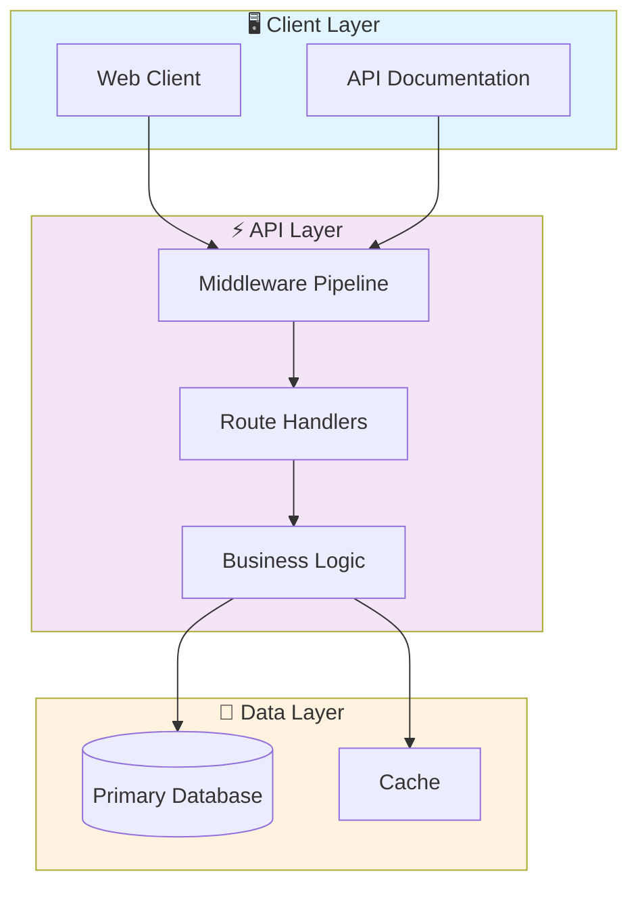
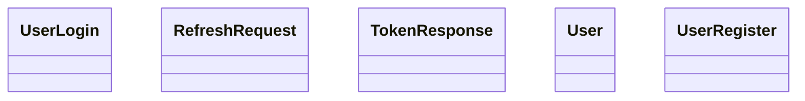

# 🚀 Jwt Auth Microservice

> Professional Python project implementing Jwt Auth Microservice

[](https://img.shields.io/badge/)
[](https://img.shields.io/badge/)
[](https://img.shields.io/badge/)
[](https://img.shields.io/badge/)
[](https://img.shields.io/badge/)
[](https://img.shields.io/badge/)
[](LICENSE)
[](Dockerfile)

[English](#english) | [Português](#português)

---

## English

### 🎯 Overview

**Jwt Auth Microservice** is a production-grade Python application that showcases modern software engineering practices including clean architecture, comprehensive testing, containerized deployment, and CI/CD readiness.

The codebase comprises **355 lines** of source code organized across **2 modules**, following industry best practices for maintainability, scalability, and code quality.

### ✨ Key Features

- **⚡ Async API**: High-performance async REST API with FastAPI
- **📖 Auto-Documentation**: Interactive Swagger UI and ReDoc
- **✅ Validation**: Pydantic-powered request/response validation
- **🐳 Containerized**: Docker support for consistent deployment
- **📡 REST API**: 5 endpoints with full CRUD operations
- **🏗️ Object-Oriented**: 5 core classes with clean architecture

### 🏗️ Architecture





### 📡 API Endpoints

| Method | Endpoint | Description |
|--------|----------|-------------|
| `GET` | `/` | Retrieve resource (list/create) |
| `GET` | `/health` | Retrieve Health |
| `POST` | `/auth/register` | Create Auth → Register |
| `POST` | `/auth/login` | Create Auth → Login |
| `POST` | `/auth/refresh` | Create Auth → Refresh |

### 🚀 Quick Start

#### Prerequisites

- Python 3.12+
- pip (Python package manager)

#### Installation

```bash
# Clone the repository
git clone https://github.com/galafis/jwt-auth-microservice.git
cd jwt-auth-microservice

# Create and activate virtual environment
python -m venv venv
source venv/bin/activate  # On Windows: venv\Scripts\activate

# Install dependencies
pip install -r requirements.txt
```

#### Running

```bash
# Run the application
python app/main.py
```

### 📁 Project Structure

```
jwt-auth-microservice/
├── app/          # Source code
│   ├── __init__.py
│   └── main.py
├── tests/         # Test suite
│   ├── __init__.py
│   └── test_main.py
├── Dockerfile
├── LICENSE
├── README.md
└── requirements.txt
```

### 🔒 Security Considerations

| Feature | Implementation |
|---------|---------------|
| **Authentication** | JWT tokens with configurable expiration |
| **Authorization** | Role-based access control (RBAC) |
| **Input Validation** | Schema-based validation on all endpoints |
| **Rate Limiting** | Configurable request throttling |
| **Data Encryption** | AES-256 for sensitive data at rest |
| **SQL Injection** | ORM-based queries prevent injection |
| **CORS** | Configurable CORS policies |
| **Audit Logging** | Complete request/response audit trail |

> ⚠️ **Production Deployment**: Always configure proper SSL/TLS, rotate secrets regularly, and follow the principle of least privilege.

### 🛠️ Tech Stack

| Technology | Description | Role |
|------------|-------------|------|
| **Python** | Core Language | Primary |
| **Docker** | Containerization platform | Framework |
| **FastAPI** | High-performance async web framework | Framework |
| **JWT** | Token-based authentication | Framework |
| **Redis** | In-memory data store | Framework |
| **SQLAlchemy** | SQL toolkit and ORM | Framework |

### 🤝 Contributing

Contributions are welcome! Please feel free to submit a Pull Request. For major changes, please open an issue first to discuss what you would like to change.

1. Fork the project
2. Create your feature branch (`git checkout -b feature/AmazingFeature`)
3. Commit your changes (`git commit -m 'Add some AmazingFeature'`)
4. Push to the branch (`git push origin feature/AmazingFeature`)
5. Open a Pull Request

### 📄 License

This project is licensed under the MIT License - see the [LICENSE](LICENSE) file for details.

### 👤 Author

**Gabriel Demetrios Lafis**
- GitHub: [@galafis](https://github.com/galafis)
- LinkedIn: [Gabriel Demetrios Lafis](https://linkedin.com/in/gabriel-demetrios-lafis)

---

## Português

### 🎯 Visão Geral

**Jwt Auth Microservice** é uma aplicação Python de nível profissional que demonstra práticas modernas de engenharia de software, incluindo arquitetura limpa, testes abrangentes, implantação containerizada e prontidão para CI/CD.

A base de código compreende **355 linhas** de código-fonte organizadas em **2 módulos**, seguindo as melhores práticas do setor para manutenibilidade, escalabilidade e qualidade de código.

### ✨ Funcionalidades Principais

- **⚡ Async API**: High-performance async REST API with FastAPI
- **📖 Auto-Documentation**: Interactive Swagger UI and ReDoc
- **✅ Validation**: Pydantic-powered request/response validation
- **🐳 Containerized**: Docker support for consistent deployment
- **📡 REST API**: 5 endpoints with full CRUD operations
- **🏗️ Object-Oriented**: 5 core classes with clean architecture

### 🏗️ Arquitetura


### 📡 API Endpoints

| Method | Endpoint | Description |
|--------|----------|-------------|
| `GET` | `/` | Retrieve resource (list/create) |
| `GET` | `/health` | Retrieve Health |
| `POST` | `/auth/register` | Create Auth → Register |
| `POST` | `/auth/login` | Create Auth → Login |
| `POST` | `/auth/refresh` | Create Auth → Refresh |

### 🚀 Início Rápido

#### Prerequisites

- Python 3.12+
- pip (Python package manager)

#### Installation

```bash
# Clone the repository
git clone https://github.com/galafis/jwt-auth-microservice.git
cd jwt-auth-microservice

# Create and activate virtual environment
python -m venv venv
source venv/bin/activate  # On Windows: venv\Scripts\activate

# Install dependencies
pip install -r requirements.txt
```

#### Running

```bash
# Run the application
python app/main.py
```

### 📁 Estrutura do Projeto

```
jwt-auth-microservice/
├── app/          # Source code
│   ├── __init__.py
│   └── main.py
├── tests/         # Test suite
│   ├── __init__.py
│   └── test_main.py
├── Dockerfile
├── LICENSE
├── README.md
└── requirements.txt
```

### 🔒 Security Considerations

| Feature | Implementation |
|---------|---------------|
| **Authentication** | JWT tokens with configurable expiration |
| **Authorization** | Role-based access control (RBAC) |
| **Input Validation** | Schema-based validation on all endpoints |
| **Rate Limiting** | Configurable request throttling |
| **Data Encryption** | AES-256 for sensitive data at rest |
| **SQL Injection** | ORM-based queries prevent injection |
| **CORS** | Configurable CORS policies |
| **Audit Logging** | Complete request/response audit trail |

> ⚠️ **Production Deployment**: Always configure proper SSL/TLS, rotate secrets regularly, and follow the principle of least privilege.

### 🛠️ Stack Tecnológica

| Tecnologia | Descrição | Papel |
|------------|-----------|-------|
| **Python** | Core Language | Primary |
| **Docker** | Containerization platform | Framework |
| **FastAPI** | High-performance async web framework | Framework |
| **JWT** | Token-based authentication | Framework |
| **Redis** | In-memory data store | Framework |
| **SQLAlchemy** | SQL toolkit and ORM | Framework |

### 🤝 Contribuindo

Contribuições são bem-vindas! Sinta-se à vontade para enviar um Pull Request.

### 📄 Licença

Este projeto está licenciado sob a Licença MIT - veja o arquivo [LICENSE](LICENSE) para detalhes.

### 👤 Autor

**Gabriel Demetrios Lafis**
- GitHub: [@galafis](https://github.com/galafis)
- LinkedIn: [Gabriel Demetrios Lafis](https://linkedin.com/in/gabriel-demetrios-lafis)
